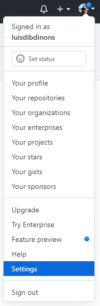
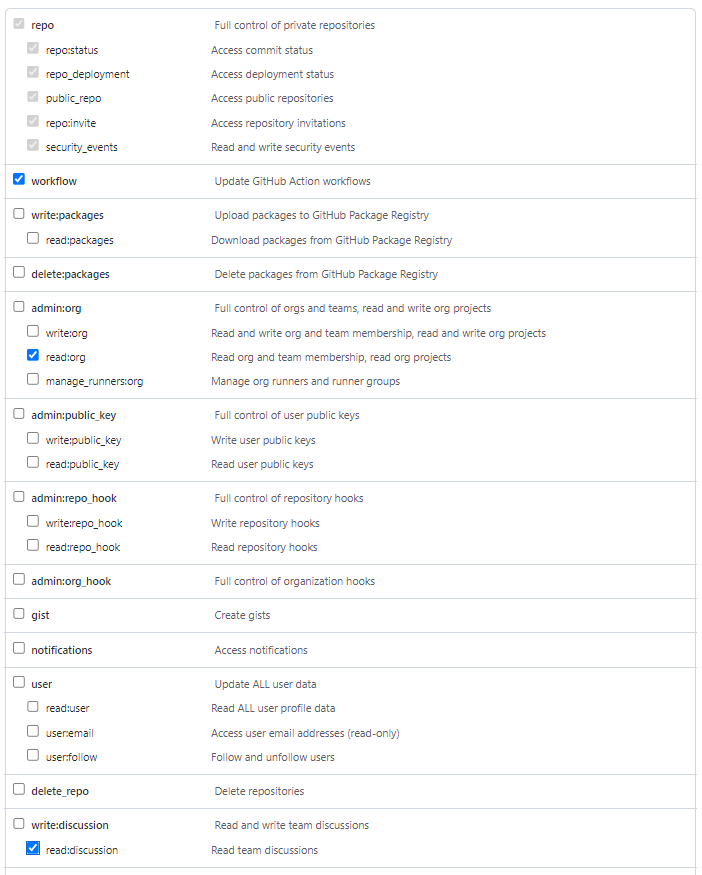
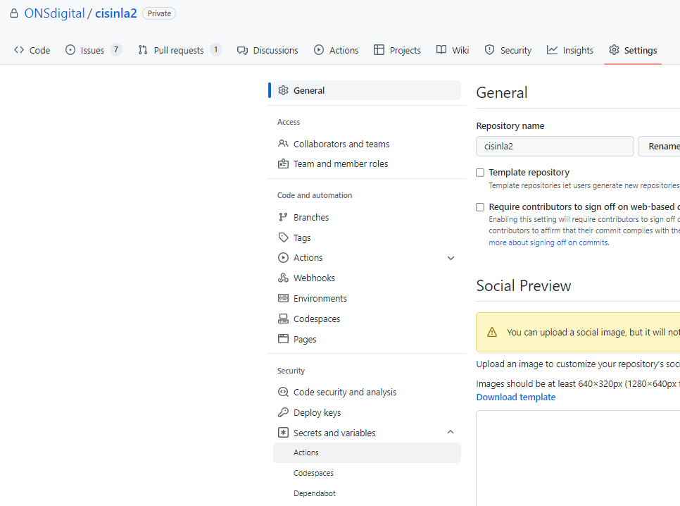
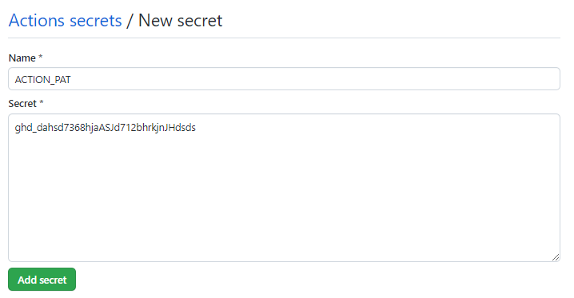
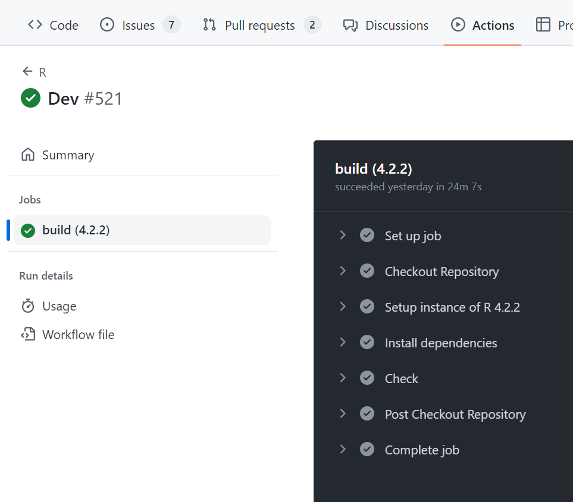

# GitHub Actions Guide

This is a document to run through the basic strucutre of an actions document, more specifically in R. The sections are:

1. PAT Token
2. Workflow Structure
3. R Specific Actions
4. Common Workflow Files

GitHub actions use user defined workflow files to automatically perform functions such as test checks, test coverage, styling or documenting. These actions can be run on specific events such as raising a pull request to a specific branch or commenting a certain word on a pull request. These checks can pass or fail and help to add robustness to any repo as you can be sure tests are passing before you merge a branch.

## PAT Token

For the GitHub actions to access the repository they are in and also any other private ONS repositories that the package depends on, they need a PAT token with access to these repos.

### PAT Token Scope

To create the PAT token you need to go to GitHub. Then, click on your **profile picture** in the top right corner and go to **Settings**.



Once here, scroll down to **Developer settings**. Then click **Personal access tokens** and in the drop-down box select **Tokens (classic)**. Here, click ** Generate new token** and in the drop-down box select **Generate new token (classic)**. 

Under **Note** give your token a clear name and in all capitals, something like **ACTION_PAT** so you know this is the token for your GitHub actions. Set the expiration date to a finite amount of time, 90 days is fine for this. Then the scopes required for this are:

- repo
- workflow
- read:org
- read:discussion



Once these scopes are selected click **Generate token**. This will then display the token. You won't be able to see this token again after exiting the page so make sure to copy it save it somewhere secure like KeePass.

### Repo Action Secrets

For the repo you are creating workflows to access this token you will need to save as a repo secret. You may need admin privelages for this or to get someone with admin privelages to add it in for you.

Start by going to the repo that you want to set up actions for and going to the **Settings** tab. Here, click **Secrets and variables** and in the drop-down section select **Actions**.



Once in the Actions secrets and variables page click the green button in the top right: **New repository secret**. This will take you to a new page where you can give your secret a name, in the **Name** box, and copy the secret itself in the **Secret** box. The name will be the value you enter in your workflow files to access this token so give it a clear name, it could be the same as the name you gave the token when creating it: **ACTION_PAT**. Once done, click **Add secret**.



## Workflow Structure

Workflow files are yaml files that life within the `.github/workflows` folder of a repo. A typical workflow file may have the following structure (this file is taken from the cisinla2 repo in `.github/workflows/r.yml`:

```
name: R

on:
  push:
    branches: [ "main", "dev" ]
  pull_request:
    branches: [ "main", "dev" ]

permissions:
  contents: read

jobs:
  build:
    runs-on: ubuntu-latest
    env:
      GITHUB_PAT: ${{ secrets.ACTIONS_PAT }}
    strategy:
      matrix:
        r-version: ['4.2.2']
      
    steps:
      - name: Checkout Repository
        uses: actions/checkout@v3
      
      - name: Setup instance of R ${{ matrix.r-version }}
        uses: r-lib/actions/setup-r@v2
        with:
          use-public-rspm: true
          r-version: ${{ matrix.r-version }}
          
      - name: Install dependencies
        run: |
          install.packages(c("remotes", "rcmdcheck"))
          remotes::install_deps(dependencies = TRUE)
        shell: Rscript {0}
        
      - name: Check
        run: rcmdcheck::rcmdcheck(args = "--no-manual", error_on = "error")
        shell: Rscript {0}
```

A workflow file starts with a name:
```
name: R
```
This is just the name given to this specific action that can be anything that describes this action. This example just runs the R CMD Check function and is just called R. When this action is run it can be found in the actions tab under the name **R**.

The next section of a workflow tells you when this action will be run:

```
on:
  push:
    branches: [ "main", "dev" ]
  pull_request:
    branches: [ "main", "dev" ]
```
In this example, the action will be run whenever someone pushes to the **main** or **dev** branch. These branches have to actually exist in the repo for the action to be run. They will also run whenever a pull request is raised to merge into **main** or **dev**.

For more information on different event triggers [this documentation](https://docs.github.com/en/actions/using-workflows/events-that-trigger-workflows) provides a comprehensive overview.

The next section is really the main part of a workflow file where you specify what the action is going to do. It is usually broken up into two parts. The first part specifies what operating system (OS) the code will run on:

```
jobs:
  build:
    runs-on: ubuntu-latest
    env:
      GITHUB_PAT: ${{ secrets.ACTIONS_PAT }}
    strategy:
      matrix:
        r-version: ['4.2.2']
```

Under `build:` you can put an OS, this can be ubuntu-latest or macos-latest. You can also pass in specific versions of each OS. We run on ubuntu-latest as the GCP Notebooks are built in Linux and therefore it makes sense to build our code on a similar OS. Under this, you can specify environment variables that will be accessible by the functions later in the workflow. Here, you can see that we are calling the secrets.ACTION_PAT, this is PAT token we created earlier and saved as a repo secret.

The final section under `strategy: matrix: ` simply saves the r-version which can then be accessed in the functions with `${{ matrix.r-version }}`.

The second part of a the jobs section is where you define the steps. The first three steps are quite standard when setting up a workflow for an R package.

```
steps:
  - name: Checkout Repository
    uses: actions/checkout@v3
  
  - name: Setup instance of R ${{ matrix.r-version }}
    uses: r-lib/actions/setup-r@v2
    with:
      use-public-rspm: true
      r-version: ${{ matrix.r-version }}
      
  - name: Install dependencies
    run: |
      install.packages(c("remotes", "rcmdcheck"))
      remotes::install_deps(dependencies = TRUE)
    shell: Rscript {0}
```

In the steps section, you can add as many steps as you need, here each step is broken up with a line break. Each step can either **use** a prebuilt action or **run** some code defined by us. Prebuilt actions can be found online and do things such as setup an instance of R or install the R dependencies of a package without us having to write the code to do that. The steps in the example above are used to:

1. Checkout the git repository so it is in the current environment.
2. Set up and instance of R, in this case version 4.2.2
3. Install remotes and rcmdcheck, immediately followed by using the remotes package to install dependencies.

All steps can be given a `name` argument. This can be anything and simply describes what that step is doing. When these actions are run each step will be run independently and given the name specified here. The first two steps are using prebuilt actions and you can see they have the structure:

```
- name:
  uses:
```

In the `uses` argument you can put the path to a prebuilt action and this action will be run during this step. If there are any parameters that needed to passed in you can do that using `with` underneath `uses`.

The third step here does not use a prebuilt action and instead uses R code. This therefore has a different structure:

```
- name:
  run:
  shell:
```

Here, the `run` and `shell` arguments are different. In `run` you write the code that you want to be executed. If it's going to be on multiple lines you can start with a `|` and use line breaks to separate the code, like so:

```
run: |
  install.packages(c("remotes", "rcmdcheck"))
  remotes::install_deps(dependencies = TRUE)
```

If the code is only going to be a single line you can just type it after the `:`.

```
run: rcmdcheck::rcmdcheck(args = "--no-manual", error_on = "error")
```

`run` does not execute the code at this point, for it to be executed you need to call it in the `shell` argument. Imagine `run` is just your R script and `shell` is a terminal where you can call the script to be run. In the `shell` argument you can write working bash code and call your script with `{0}`.

```
shell: Rscript {0}
```

Using Rscript, this will then run the code.

### Running Actions

Once a workflow file has been created it can be run when the event trigger specificed in the file occurs. The result of these actions can be found in the actions tab in a repo.



In here, you can view all the steps of an action and if it has failed at any point you can see where.

## R Specific Actions

In the previous section we talked about workflow files and how some steps use prebuilt actions. A few of these actions are specific to R and used for setting up the instance of R and installing R dependencies.

The first action is:

```
uses: r-lib/actions/setup-r@v2
with:
  use-public-rspm: true
  r-version: ${{ matrix.r-version }}
```

The r-version can be passed in which is useful for checking your package works on different versions of R. You can create multiple workflows just with different R versions if you need to check across different R versions.

The second useful action is `setup-r-dependencies`:

```
- name: Install packages and dependencies
  uses: r-lib/actions/setup-r-dependencies@v2
  with:
    extra-packages: any::rcmdcheck, survival=?ignore-before-r=3.5.0
    needs: check
```

What makes this action so useful is that it caches your dependencies so it doesn't need to install existing ones every time you run an action which saves lots of time.

If you need to install extra packages you can do so with the `extra-packages` argument under `with`. In this example we install rcmdcheck. In the example below we install the covr package to generate a code coverage report of our package.:

```
uses: r-lib/actions/setup-r-dependencies@v2
with:
  extra-packages: any::covr
  needs: coverage
```

## Common Workflow Files

### R CMD Check

This workflow file runs the R CMD Check command, similar to running `devtools::check`. This check will fail if any of your tests fail or if examples in your documentation do not work. It will throw warnings just like `devtools::check` but still pass if documentation is not correct, e.g. params are incorrectly documented or if there are warnings in your tests.

### Test Coverage

Similar to R CMD Check, this workflow file runs the repo tests but also generates a coverage report with codecov. For this to work properly you need to add your repo to [codecov.io](https://app.codecov.io/) and generate a codecov token. This will then upload your code coverage report and allow you to see which lines of code are currently untested.

### Style

This workflow file styles all your code for you.

### Document

This workflow file documents all your code for you.